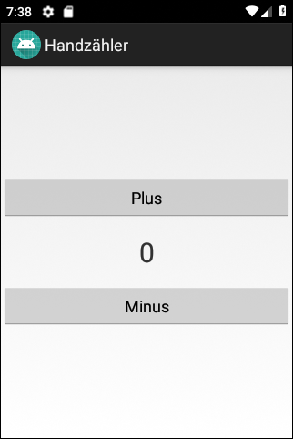
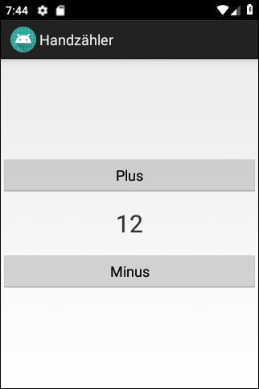

# Android-App "Handzähler" #

 

Die App repräsentiert einen einfachen [Handzähler](https://de.wikipedia.org/wiki/Handz%C3%A4hler).
Der Zweck der App ist die Demonstration von Event-Handling.

 

Es gibt also eine [Variante dieser App für WearOS](https://github.com/MDecker-MobileComputing/HandzaehlerFuerWearOS).

 

----

## Screenshots ##

 

 &nbsp;  

 

----

## License ##

 

See the [LICENSE file](LICENSE.md) for license rights and limitations (BSD 3-Clause License).

 